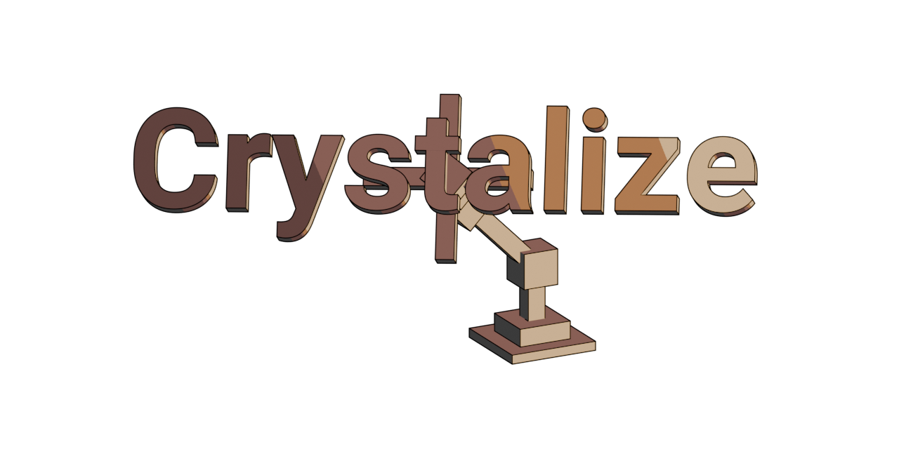

<p align="center">

</p>

---
# Crystalize
_I've reimplemented [Nylon](https://modrinth.com/mod/nylon), but at what cost?_

Crystalize uses display entities to display models from Blockbench (non-cube meshes are not supported, obviously) on your Minecraft server. Simply drag and drop Blockbench model to your mod, use `ModelsManager.registerModel()` and you are ready to go! Sounds simple but I wasted more than 40 hours of my life just to cook this library mod (and it's not even finished yet).

<p align="center">
 
<br>
Custom model animation completely client-side!
</p>

## Features
### Blockbench Models loader
Load models directly from your Blockbench project file! Crystalize will automatically construct all model parts as JSON models and assign it to custom model data value of `minecraft:command_block`.

### Inverse Kinematics
Tired of animating each part one by one? Now you can use `FabrikController` ([FABRIK][FABRIK Paper] is the name of the IK algorithm)! This IK controller automatically animates your model parts such that the end position of the chain reaches your target position. _IK constraints is supported but you might need to convert direction vector to rotation and vice versa._

<p align="center">

<br>
Inverse Kinematics (unconstrained)
</p>

## Attaching Crystalize model to your entity
It is pretty simple to attach Crystalize model to your entity. Here is an example:

```java
public class RoboticArmEntity extends Entity implements PolymerEntity {
	private static final Identifier MODEL_ID = new Identifier(CrystalizeSampleMod.MODID, "robotic_arm");
	private CrystalizeElementHolder modelHolder;
	private Vector3f target = new Vector3f();

	public RoboticArmEntity(EntityType<? extends RoboticArmEntity> type, World world) {
		super(type, world);
		EntityAttachment.ofTicking(modelHolder = new CrystalizeElementHolder(MODEL_ID, TranslateStrategy.TRANSLATION_ONLY), this);

		// Let's make our robotic arm tracking nearby players!
		// Get these IDs from robotic_arm.bbmodel
		modelHolder.addAnimation(new FabrikController(Arrays.asList(
			"984422d6-82df-2fc5-9509-809912aa01fd",
			"fd6d3d3e-aa57-518e-b758-3e56901278ea",
			"e99bebd5-5564-9731-9819-3bb487096f1c"), target));
	}

	public RoboticArmEntity(World world, Vec3d pos) {
		this(TYPE, world);
		setPosition(pos);
	}

	@Override
	public EntityType<?> getPolymerEntityType(ServerPlayerEntity player) {
		return EntityType.INTERACTION;
	}

	// Stripped initDataTracker, readCustomDataFromNbt and writeCustomDataToNbt.

	@Override
	public void tick() {
		super.tick();
		PlayerEntity closest = getWorld().getClosestPlayer(getX(), getY(), getZ(), 3d, false);
		if (closest == null) return;
		target.set(closest.getPos().toVector3f()).sub(getPos().toVector3f());
	}
}
```

See [this code](./crystalize-fabric-samplemod/src/main/java/io/github/nahkd123/crystalize/fabric/sample/entity/RoboticArmEntity.java), which is the code above but with comments.

## Crystalize components
### Crystalize Base
The common code for all platforms and components. Includes Crystalize model structure, animations and animation controllers.

### Crystalize Blockbench
Includes codecs for reading Blockbench's "Generic Model" project, as well as component for building to Crystalize model (which is `Model`).

### Crystalize Minecraft Model
Includes codecs for reading and writing Minecraft JSON models + texture atlases, as well as builder for building `ElementGroup` into JSON model.

### Crystalize Fabric Polymer
Powered by [Polymer Virtual Entity](https://polymer.pb4.eu/latest/polymer-virtual-entity/basics/), this component allows you to load your Crystalize model in your Fabric server and control it. See `crystalize-fabric-samplemod` for example usage.

### Crystalize Bukkit (WIP)
Bukkit implementation. Work in progress but the priority for this platform is not high.

## License and acknowledgments
The Crystalize and its components' code are licensed under [MIT license](./LICENSE).

[Mojang's DataFixerUpper](https://github.com/Mojang/DataFixerUpper) and [JOML](https://github.com/JOML-CI/JOML) are licensed under MIT license.

[Patbox's Polymer](https://github.com/Patbox/polymer) and its components are licensed under [LGPL 3.0](https://github.com/Patbox/polymer/blob/dev/1.20.3/LICENSE).

The sample models are mainly licensed under CC0 1.0 Universal license, except:
- The "Taterinator" 3D model uses "Tiny Potato" texture from Botania by Vazkii/Violet Moon, which is [licensed under custom license](https://github.com/VazkiiMods/Botania/blob/1.20.x/LICENSE.txt). I honestly don't know if they are willing to let me license the model under CC0 1.0, but like, it's just a :), right? RIGHT?
- The "tiny_potatog" test model uses frog entity model from Mojang Studios. (c) Mojang Studios/Microsoft Corporation.

Paper: ["FABRIK: A fast, iterative solver for the Inverse Kinematics problem"][FABRIK Paper] by Aristidou, Andreas and Lasenby, Joan. [DOI](https://doi.org/10.1016/j.gmod.2011.05.003).

---


[FABRIK Paper]: http://www.andreasaristidou.com/publications/papers/FABRIK.pdf