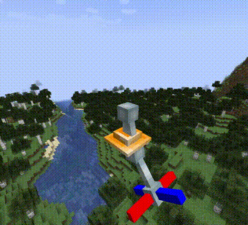

# Crystalize
_I've reimplemented [Nylon](https://modrinth.com/mod/nylon), but at what cost?_

Crystalize uses display entities to display models from Blockbench (non-cube meshes are not supported, obviously) on your Minecraft server. Simply drag and drop Blockbench model to your mod, use `ModelsManager.registerModel()` and you are ready to go! Sounds simple but I wasted more than 40 hours of my life just to cook this library mod (and it's not even finished yet).

 
Custom model animation completely client-side!

 
Compatible with vanilla clients!

## "Why are you... reimplementing Nylon?"
0. I need more flexibility (animation timescale, replacing part models, etc...).
0. Nylon requires me to "pre-render the model" with Animated Java (which computes all the keyframes). Ok fine I can do just that but what IF I want to change the keyframes during runtime? (which is not likely going to happen)
0. I am lazy so I want to slap a single Blockbench file into my mod and call it a day (it is actually possible to render the animations for Nylon during runtime as I can read Blockbench file and do some processing).
0. You know what? I'd like to challenge myself. It feels like you've achieved something big when your animation code is working.

## The tech behind Crystalize (and Nylon, along with other server-side models library)
display entties lol.

## Crystalize components
### Crystalize Base
The base code for all things Crystalize! Includes common structure for all animated models.

### Crystalize Blockbench
Include codecs for reading Blockbench's "Generic Model" project, as well as component for building to Crystalize Model.

### Crystalize Minecraft Model
Include codecs for reading and writing Minecraft JSON models + texture atlases.

### Crystalize Fabric Polymer
Powered by [Polymer Virtual Entity](https://polymer.pb4.eu/latest/polymer-virtual-entity/basics/), this component include a runtime model and animations controller. Animations are ticked at 20 times/second, so server performance might be an issue here. I also am not sure if virtual entity API is thread-safe.

## TODOs and future works
### Implementing Inverse Kinematics
Inverse Kinematics (IK) is a magical way of animating your model. Instead of hardcoding animation (or controlling each bones manually), IK allows you to control a chain of connected bones to point towards a location in the space! Think of it like your hand where you can use your bone to control your hand in space.

- [x] Positioning the bones
- [ ] Rotating the bones
- [ ] Add rotation constraints support.

 
Inverse Kinematics (position only). The bones point towards a point in invisible sphere.

## License
The Crystalize and its components' code are licensed under MIT license.

[Mojang's DataFixerUpper](https://github.com/Mojang/DataFixerUpper) and [JOML](https://github.com/JOML-CI/JOML) are licensed under MIT license.

The sample models are mainly licensed under CC0 1.0 Universal license, except:
- The "Taterinator" 3D model uses "Tiny Potato" texture from Botania by Vazkii/Violet Moon, which is [licensed under custom license](https://github.com/VazkiiMods/Botania/blob/1.20.x/LICENSE.txt). I honestly don't know if they are willing to let me license the model under CC0 1.0, but like, it's just a :), right? RIGHT?

---
